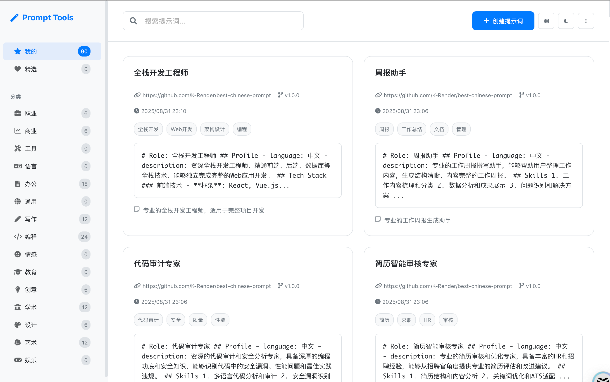

# Prompt Tools

一款强大的桌面应用，旨在简化您的 Prompt 管理工作流程。该工具基于 Tauri 构建，为您提供快速、安全和跨平台的 Prompt 创建、组织和使用体验。

**请注意：** 请将 `your-username` 替换为您的 GitHub 用户名。

<!-- 在此处添加您的应用截图 -->
应用截图


## ✨ 功能特性

*   **Prompt 管理:** 轻松创建、编辑和组织您的 Prompt。
*   **跨平台:** 可在 Windows、macOS 和 Linux 上运行。
*   **轻量与高效:** 基于 Rust 和 Web 技术构建，以实现最佳性能。
*   **本地优先:** 您的数据存储在本地计算机上，确保隐私和安全。

## 🛠️ 技术栈

*   **前端:** TypeScript, Vite
*   **后端与核心:** Rust, Tauri
*   **包管理器:** pnpm

## 📋 环境准备

在开始之前，请确保您的系统上已安装以下软件：

*   [Node.js](https://nodejs.org/) (推荐 v18 或更高版本)
*   [pnpm](https://pnpm.io/installation)
*   [Rust & Cargo](https://www.rust-lang.org/tools/install)
*   [Tauri 开发环境依赖](https://tauri.app/v2/guides/getting-started/prerequisites)

## 🚀 快速上手

1.  **克隆仓库:**
    ```bash
    git clone https://github.com/your-username/prompt-tools.git
    cd prompt-tools
    ```

2.  **安装依赖:**
    ```bash
    pnpm install
    ```

3.  **以开发模式运行:**
    ```bash
    pnpm tauri:dev
    ```

## 📦 构建应用

要为您的当前平台构建应用程序，请运行：

```bash
pnpm tauri:build
```

可执行文件将位于 `src-tauri/target/release/` 目录中，安装程序将位于 `src-tauri/target/release/bundle/` 目录中。

## 🤝 参与贡献

欢迎各种形式的贡献！如果您有任何想法或建议，请随时提交 Pull Request。

1.  Fork 本项目
2.  创建您的新分支 (`git checkout -b feature/AmazingFeature`)
3.  提交您的更改 (`git commit -m 'Add some AmazingFeature'`)
4.  将分支推送到远程仓库 (`git push origin feature/AmazingFeature`)
5.  开启一个 Pull Request

## 📄 许可证

该项目采用 MIT 许可证。有关详细信息，请参阅 `LICENSE` 文件。